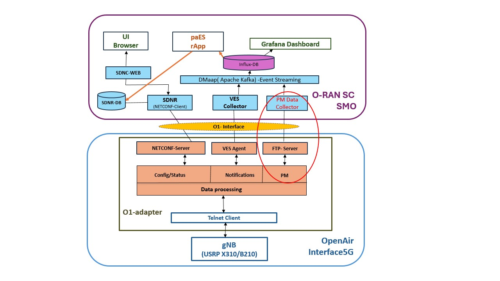

# Energy Optimization

This repository provides an **energy optimization infrastructure** for **OAI5G-Radio Access Network (RAN)** environment.  
It integrates various components including performance-aware Energy Saver (paES) rApp and O1/VES adapters to create a modular, testable energy optimization stack aligned with O-RAN and SMO frameworks.

---
## 🧱 System Architecture



<p align="center">
  
</p>


## 📂 Submodules

This repository integrates the following Git submodules:

| Submodule | Description |
|----------|-------------|
| [`smo-ves`](https://github.com/Energy-optimization/smo-ves.git) | VES (VNF Event Stream) collector for SMO events |
| [`smo-o1`](https://github.com/Energy-optimization/smo-o1.git) | O1 interface handler for managing RAN elements |
| [`o1-adapter`](https://github.com/Energy-optimization/o1-adapter.git) | Adapter layer for O1 interface communication |
| [`openairinterface5g`](https://github.com/Energy-optimization/openairinterface5g) | Fork of OpenAirInterface 5G stack for RAN testing |
| [`paES-rApp`](https://github.com/Energy-optimization/performance-aware-rApp.git) | rApp focused on performance-aware energy optimization in RAN |

---

## 🛠️ Installation and Setup Instructions

### 1. Clone the Repository with Submodules
```
$ git clone https://github.com/Energy-optimization/Energy-optimization#
$ cd Energy-optimization
```

---

### 2. Install Submodules and Dependencies

---

#### 2.1 openairinterface5g

Follow the official [OAI installation guide](https://gitlab.eurecom.fr/oai/openairinterface5g) for complete build instructions.

**Quick Start Example:**
```
$ cd openairinterface5g
$ sudo apt update
$ sudo apt install -y build-essential cmake libboost-all-dev
```
Then follow the instructions in \`openairinterface5g/README.md\`.

To run the gnb config file along with telnet-o1 server, use the below command
```
$ sudo ./nr-softmodem -E -O ../../../targets/PROJECTS/GENERIC-NR-5GC/CONF/gnb.sa.band78.fr1.106PRB.usrpx310.conf --sa --telnetsrv --telnetsrv.shrmod o1
```
---

#### 2.2 o1-adapter
```
$ cd o1-adapter
```
- To install using Docker:
```
$ ./build-adapter.sh --adapter
```
- To configure and run the O1 adapter with the NetConf server:
```
$ ./start-adapter.sh
```
---

#### 2.3 smo-o1

```
$ cd smo-o1
```

Install and run the SDN controller:
```
$ ./sdnr.sh
```
---

#### 2.4 smo-ves
```
$ cd smo-ves
```
Follow the official documentation:  
📎 [https://github.com/o-ran-sc/smo-ves](https://github.com/o-ran-sc/smo-ves)

This includes installation of:
- VES Collector
- InfluxDB Connector
- Grafana
- Additional dependencies

---

#### 2.5 paES-rApp
```
$ cd performance-aware-rApp
```
Run the Python script to transition the RU into a sleeping state:
```
$ python3 performance-aware-rApp.py
```
---

## 📊 Power Measurement Data

Power consumption results are included in [\`docs/power_measurements.xlsx\`](docs/power_measurements.xlsx).

---


